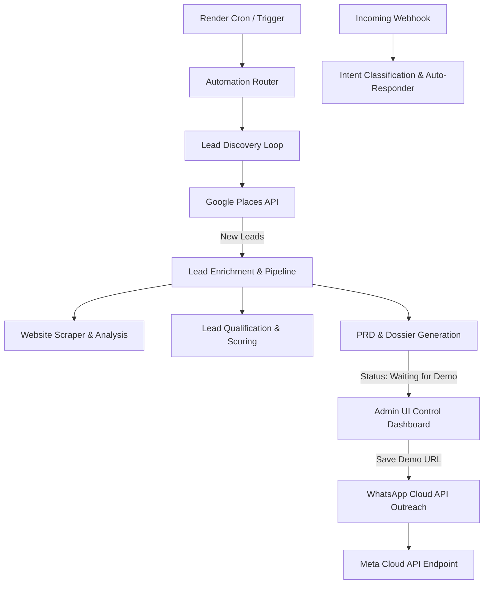

# Final Project Documentation — AI Website Sales Automation Agent

This document summarizes the final architecture, implemented features, lead lifecycles, security configurations, and verification test results for the updated **Flixora AI Website Sales Automation Agent**.

---

## 1. System Architecture

The application is built on Flask (Python 3.12) with a unified relational SQLite database.



---

## 2. Preserved Features

All original features from Phases 1–8 are fully preserved and functional:
- **Authentication & Security**: Secure logins, session management, and rate-limiting.
- **LLM Provider Routing**: Fallback priorities across OpenRouter, Gemini, and local providers.
- **Lead Discovery**: Google Places API lead scanner with de-duplication.
- **Website Audit**: Real-time scraper, responsive scoring, and recommendation logging.
- **PRD System**: Automated product requirements drafting.
- **Isolated Client Conversations**: Dedicated history logs for every lead.

---

## 3. Automation Flow & Timezone-Aware Limits

- **Global Toggle**: ON/OFF switch controls background worker execution.
- **Lead Limit**: Caps new qualified leads to 20/day (configurable).
- **Timezone Enforcement**: Respects the agent's timezone configuration (`Asia/Kolkata` by default) to dynamically compute daily capacity.
- **Concurrency Locks**: Uses active database checks (`check_discovery_locked()`) to block duplicate concurrent worker threads.
- **Cron Trigger**: Exposes a secure POST endpoint `/automation/trigger-cron` authenticated via `X-Cron-Secret` header validation.

---

## 4. Lead Lifecycle

```
[DISCOVERED] -> [QUALIFIED/DISQUALIFIED] -> [WEBSITE_ANALYSIS_RUN] -> [PRD_READY] -> [WAITING_FOR_DEMO] -> (Admin enters Demo URL) -> [OUTREACH_SENT] -> [CLIENT_REPLIED]
```

---

## 5. Website Analysis & PRD Workflow

- **Website Check**: Triggers immediately after lead creation. If no website exists, categorizes as `NO_WEBSITE`.
- **PRD Generation**: Personalized requirements list is saved into the `PRD` table with status `'ready'`.
- **Pipeline Stop**: The automatic flow stops after PRD and dossier generation. No automatic GitHub code compilation or auto-outreach is triggered.

---

## 6. WhatsApp Cloud API & Webhook Setup

- **Adapter**: Uses the official Meta Business Cloud API endpoint to submit outbound text campaigns.
- **Webhook Integration**:
  - `GET /conversations/webhook`: Subscription validation matching configured verify tokens.
  - `POST /conversations/webhook`: Parses incoming message payloads, resolves lead records by phone, logs history, runs intent classification, and issues auto-replies if human takeover is disabled.
- **Intent Classifier**: Automatically updates message records with `detected_intent`, `confidence`, and `sales_stage`.

---

## 7. Exports & Downloads

- **PRD Download**: Exposes PRD drafts as Markdown files.
- **Details Download**: Serves a comprehensive plain text report containing all scraped, scored, analyzed, and conversation details.

---

## 8. Security & Encryption

- Encrypts Meta tokens, API keys, and SMTP passwords at rest using Fernet symmetric encryption.
- Enforces strict CSRF exemption decorations on external webhook routes (`/webhook` and `/trigger-cron`).

---

## 9. Verification & Test Results

A full verification was run against the suite:
- **Total Tests**: 82
- **Passed**: 82
- **Failure Count**: 0
- **Flakiness Mitigation**: Rate limiting is automatically bypassed when `TESTING` configuration is active.
